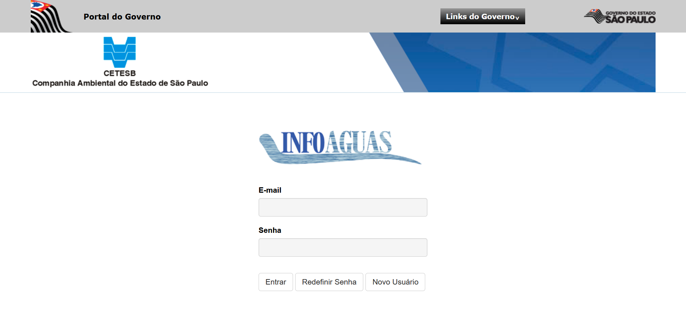
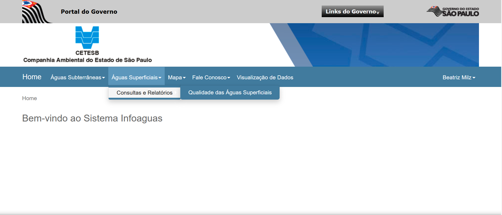
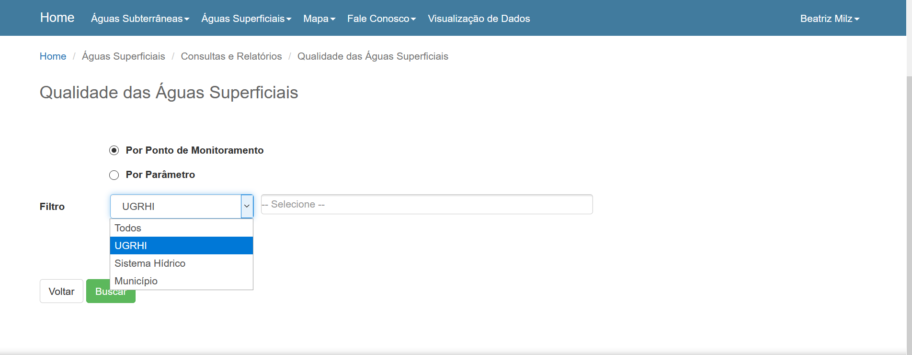
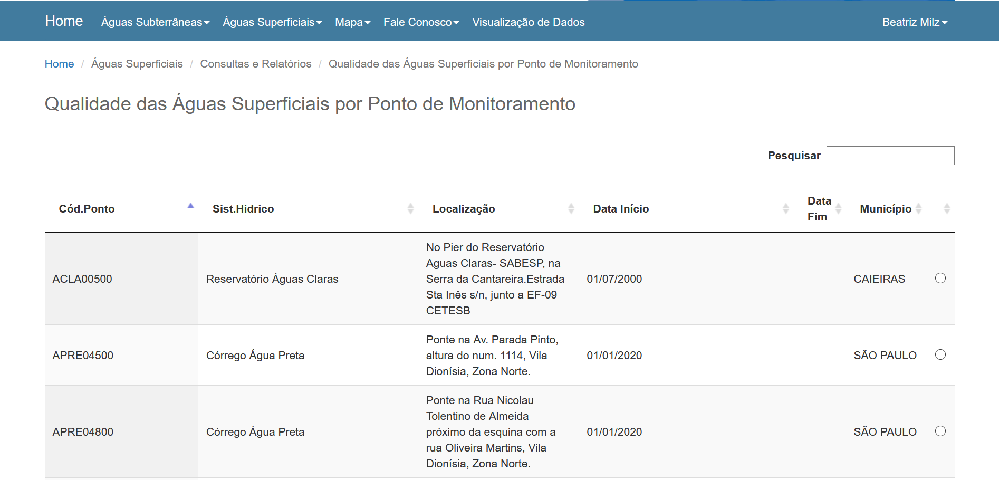
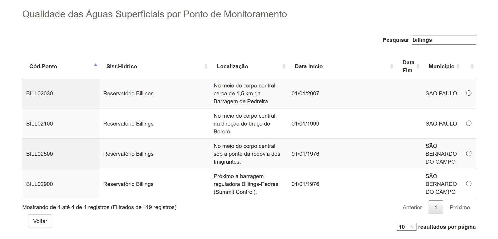
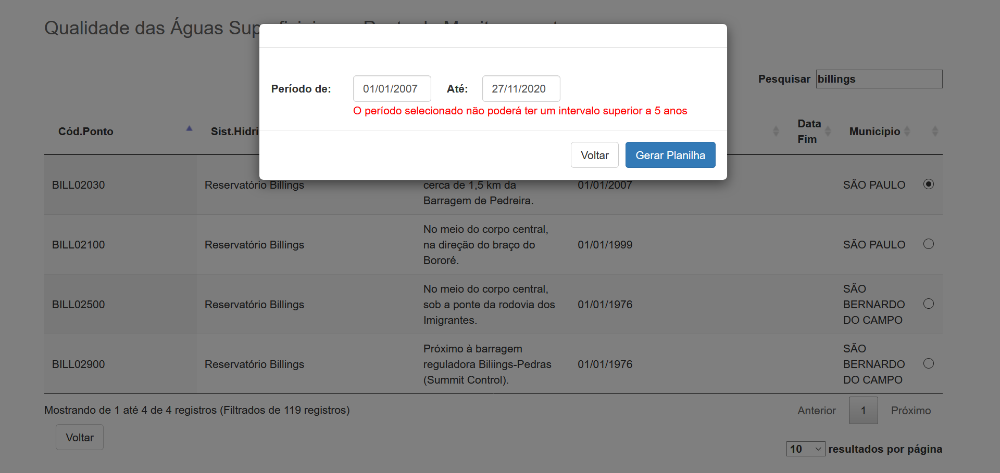
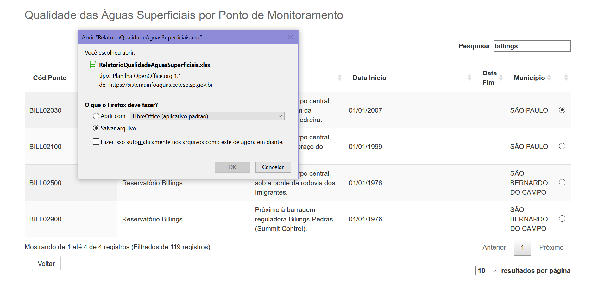
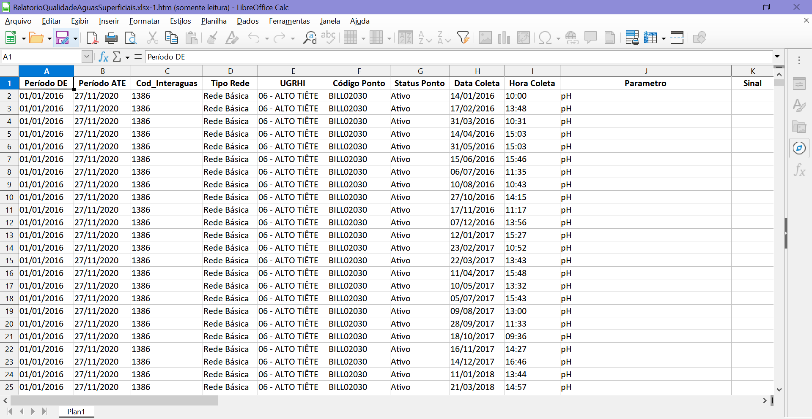

```{r setup, include=FALSE}
library(learnr)
library(magrittr)
knitr::opts_chunk$set(echo = TRUE, out.width="90%", fig.align = "center")
tutorial_options(exercise.cap = "Código")
sampling_points <- readr::read_csv2("sampling_points.csv")
```

**Trabalho final para o curso '[Web Scraping](https://www.curso-r.com/cursos/web-scraping/)'**. <br>
**[Beatriz Milz](https://beatrizmilz.com)**   <a href='mailto:beatriz.milz@usp.br'><i class="far fa-envelope"></i></a>   <a href='https://twitter.com/BeaMilz'  target="_blank"><i class="fab fa-twitter"></i></a>   <a href='https://github.com/beatrizmilz' target="_blank"><i class="fab fa-github"></i></a>   <a href='https://orcid.org/0000-0002-3064-4486' target="_blank"><i class="fab fa-orcid"></i></a>   <a href='http://lattes.cnpq.br/5150665880581477' target="_blank"><i class="ai ai-lattes"></i></a>   <a href='https://beatrizmilz.github.io/resume/index.html' target="_blank"><i class="ai ai-cv"></i></a>   <a href='https://discourse.curso-r.com/u/beatrizmilz/summary' target="_blank"><i class="fab fa-discourse"></i></a> 
<br>

Atualizado em `r format(Sys.Date(), format='%d de %B de %Y')`.

## Contextualização

Boas vindas! Esta página corresponde ao trabalho final para o curso [Web Scraping](https://www.curso-r.com/cursos/web-scraping/), oferecido pela [Curso-R](https://www.curso-r.com/) e ministrado por [Julio Trecenti](https://github.com/jtrecenti) e [Caio Lente](https://lente.dev/). O objetivo proposto para o trabalho final é construir um produto de dados que utilize Web Scraping.

### Introdução

> Falar da dificuldade para obter dados da qualidade da água/ambientais

A Companhia Ambiental do Estado de São Paulo (CETESB) é a agência ambiental responsável pelo desenvolvimento de ações de controle, licenciamento, fiscalização e monitoramento das atividades potencialmente poluidoras no Estado de São Paulo[*](https://www.saopaulo.sp.gov.br/orgaos-e-entidades/empresas/cetesb/). Essa agência realiza o monitoramento da qualidade das águas das praias, rios, represas, do ar e do solo no Estado de São Paulo.


Os dados referentes ao monitoramento da qualidade do ar são disponibilizados no sistema [Qualar](https://cetesb.sp.gov.br/ar/qualar/), e o sistema [Infoaguas](https://cetesb.sp.gov.br/infoaguas/) disponibiliza dados referentes à qualidade da água. Entretanto, não existe uma API (_Application Programming Interface_) pública para acesso dessas informações, e ambos os sistemas foram elaborados de forma que obter informações para um amplo recorte espacial e temporal seja trabalhoso, requerendo bastante trabalho manual. 

```{r include=FALSE}
pontos_ativos <- sampling_points %>% 
  dplyr::filter(is.na(data_fim))
```

O pacote [`Rpollution`](https://github.com/williamorim/Rpollution), desenvolvido por @R-Rpollution,  disponibiliza funções para obter os dados do sistema Qualar utilizando a linguagem de programação R e técnicas de Web Scraping. Entretanto, não foi encontrado alguma ferramenta similar para obtenção dos dados disponibilizados no sistema Infoaguas. Esses dados são importantes para acompanhar a situação de qualidade dos principais mananciais de abastecimento público do Estado de São Paulo[*](https://cetesb.sp.gov.br/aguas-interiores/programa-de-monitoramento/). 

> Segundo os dados disponibilizados no sistema Infoaguas, atualmente existem `r nrow(pontos_ativos)` pontos de coleta ativos no Estado de São Paulo.


Portanto, __o objetivo deste trabalho foi desenvolver funções que possibilitem acessar os dados disponibilizados no sistema Infoaguas para Águas Superficiais__, para que pessoas pesquisadoras, jornalistas, e outras interessadas possam ter acesso à estes dados de forma automatizada. Ao final, para exemplificar o uso dos dados obtidos, __uma breve análise descritiva será realizada com os dados de qualidade da água no território da Macrometrópole Paulista__.

### Pacotes utilizados


```{r include=FALSE}
listar_pacotes <- function(vetor){
  vetor %>% tibble::as_tibble() %>% dplyr::arrange(value) %>% 
    dplyr::mutate(citacao = glue::glue("`{value}` [@R-{value}]")) %>% 
    dplyr::summarise(citacao_completa = knitr::combine_words(citacao, and = "e ")) %>% 
    dplyr::pull()
  
}

pacotes_funcoes <- c("httr", "magrittr", "xml2", "purrr", "dplyr", "rvest", "janitor", "tibble")
pacotes_usados_funcoes <- listar_pacotes(pacotes_funcoes)


pacotes_relatorio <- c("learnr", "knitr", "readxl", "DT", "rmarkdown", "glue", "sf")
pacotes_usados_relatorio <- listar_pacotes(pacotes_relatorio)

```

Nas funções desenvolvidas neste trabalho, foram usados dos seguintes pacotes: `r pacotes_usados_funcoes`. 


Além destes, para a elaboração deste relatório também foi utilizado os pacotes `r pacotes_usados_relatorio`.


## Acessando os dados

Para demonstrar como funciona o acesso manual no sistema Infoaguas, a seguir estão algumas _screenshots_ que demonstram o fluxo de navegação no site até que seja possível obter os dados.

1. Ao acessar o Sistema INFOAGUAS (através do link https://sistemainfoaguas.cetesb.sp.gov.br/ ), é solicitado a autenticação através de login e senha. Caso não tenha um cadastro, é possível realizar através do botão "Novo Usuário".

```{r echo=FALSE}

```

2. Após a autenticação, o site direciona para uma página de boas vindas. Para acessar os dados referentes à Águas Superficiais (como rios e reservatórios), é necessário clicar em: "Águas Superficiais > Consultas e Relatórios > Qualidade das Águas Superficiais".

```{r echo=FALSE}

```

3. O site direciona para uma página com um formulário de pesquisa, onde é possível fazer a pesquisa:
  - Por ponto de monitoramento
  - Por parâmetro.
  


Neste mesmo formlário,  é possível filtrar por:
  - Todos (sem filtro)
  - UGRHI (Unidade de Gerenciamento de Recursos Hídricos. Por exemplo: Alto Tietê)
  - Sistema Hídrico (por exemplo: Represa Billings)
  - Município
  
Neste exemplo realizaremos a pesquisa por ponto de monitoramento, e por UGRHI, escolhendo Alto Tietê.


```{r echo=FALSE}

```

4. Após clicar em "Buscar" o site direciona para uma página com uma tabela contendo informações sobre os pontos de monitoramento. É uma tabela interativa (feita com [DataTables](https://datatables.net/)), onde há um campo que possibilita pesquisar algum termo na tabela.   


```{r echo=FALSE}

```
5. Neste exemplo, a pesquisa foi feita  com o termo 'Billings', para buscar pontos de monitoramento no Reservatório Billings, resultando em 4 pontos.

```{r echo=FALSE}

```

```{r include=FALSE}
n_pesquisas <-
  sampling_points %>% dplyr::filter(sist_hidrico == "Reservatório Billings") %>%
  dplyr::mutate(
    data_final = dplyr::case_when(is.na(data_fim) ~ Sys.Date(),
                                  TRUE ~ data_fim),
    tempo_operacao = data_final - data_inicio,
    anos_operacao = as.double(tempo_operacao / 365),
    pesquisas = ceiling(anos_operacao / 5)
  )

total_pesquisas_billings <-
  n_pesquisas %>% dplyr::summarise(sum(pesquisas)) %>% dplyr::pull()

```

6. Ao selecionar o botão (radio button) correspondente ao ponto de monitoramento, é solicitado informar o período da consulta, preenchendo a data inicial e a data final. 

> Importante destacar que o formulário limita este período para um intervalo de tempo de até 5 anos, o que implica que a obtenção de todos os dados disponíveis para a Represa Billings manualmente necessitaria que a pesquisa fosse feita `r total_pesquisas_billings` vezes! 


```{r echo=FALSE}

```


7. Após informar um período válido, aparece uma caixa onde é possível realizar o download da base de dados em formato `.xlsx` .


```{r echo=FALSE}

```

Exemplo do arquivo obtido:

```{r echo=FALSE}

```

A base de dados disponibilizada neste exemplo apresenta medições referentes à diversos parâmetros: 

```{r echo=FALSE, message=FALSE, warning=FALSE}
pesquisa_infoaguas_exemplo <- readxl::read_excel("pesquisa_infoaguas_exemplo.xlsx")
```

```{r echo=FALSE, message=FALSE, warning=FALSE}
pesquisa_infoaguas_exemplo %>% 
  janitor::clean_names() %>%
  dplyr::group_by(tipo_parametro) %>%  
  dplyr::distinct(parametro) %>% 
  dplyr::arrange(tipo_parametro, parametro) %>% 
  dplyr::relocate(tipo_parametro, .before = parametro) %>% 
  dplyr::summarise(parametros = knitr::combine_words(parametro, and = "e ")) %>% 
  knitr::kable(col.names = c("Tipo de parâmetro", "Parâmetros"))
```

## Funções desenvolvidas

A seguir, apresento uma breve descrição das funções desenvolvidas neste trabalho. 

### Autenticação no sistema

O sistema InfoÁguas solicita login para acessar os dados. Portanto, primeiramente é necessário realizar a autentição.

A função `login_infoaguas()` tem como argumentos o email (`login`) e a senha (`password`), e realiza a autenticação no sistema Infoaguas através de uma requisição do tipo `POST`.


Obs: Nesta etapa foi necessário pedir ajuda aos professores!

```{r eval=FALSE, include=TRUE}
login_infoaguas(login =  ... ,
                password = ...)
```

### Obter pontos de coleta 

Para possibilitar a realização das buscas para os pontos de monitoramento, é necessário ter informações sobre os pontos de monitoramento. A função `get_sampling_points()` realiza um Web Scraping e retorna uma base contendo informações sobre os pontos. Obs: Essa base será descrita posteriormente. Não é necessário informar argumentos para essa função.


```{r eval=FALSE, include=TRUE}
get_sampling_points() 
```


### Buscar dados de qualidade da água
> Em breve!


## Bases de dados obtidas

### Pontos de coleta

```{r message=FALSE, warning=FALSE}
DT::datatable(sampling_points)
```

### Dados de qualidade da água

> Em breve!


## Análise descritiva dos dados

> Em breve!

## Agradecimentos

- [Post sobre o scraper do QUALAR](https://www.curso-r.com/blog/2018-03-19-scraper-cetesb/) - Por William Amorim

## Referências

```{r echo=FALSE, message=FALSE, warning=FALSE}
knitr::write_bib(c('Rpollution', pacotes_funcoes, pacotes_relatorio), 'packages.bib')
```

<!-- This '<div id="refs"></div>' needs to 
be here if you have appendix pages 
otherwise you can remove it.-->
<div id="refs"></div> 


